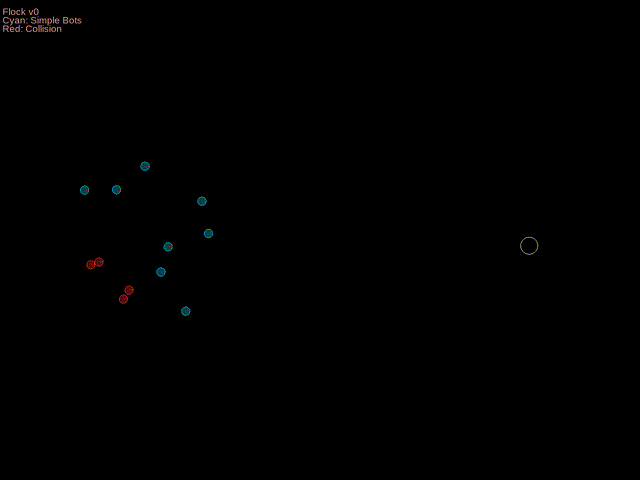

There are two ways to run environments

1) Providing actions for all agents at each time step 
Environments cannot be rendered in real-time. This way is suited for training or sample collection.
```python
import gym  
n_agents = [4]  
env = gym.make("gym_macm:cm-flock-v0", n_agents=n_agents)  
obs = env.obs  
while not env.done:  
    actions = {}  
    for agent in env.agents:  
        actions[agent.id] = myActor(obs[agent.id])  
    obs, rewards = env.step(actions)  
```

2) Providing actors for each agent at the creation of the environment

```python
from Box2D import b2Color  
n_agents = [4]  
actors = [myActor1()] * 2 + [myActor2()] * 2  
colors = [b2Color(0.6, 0.2, 0.6)] * 2 \  
         [b2Color(0.2, 0.7, 0.2)] * 2  
env = gym.make("gym_macm:cm-flock-v0",  
                n_agents = n_agents, actors = actors, colors = colors,  
                render = True, verbose_display = True)  
env.run()  
```

Flocking
-----

Agents are expected to move to a randomly selected target location (If rendered, you can click to change the target location). In binary reward mode, an agent is rewarded +1 
if it is close to the target, within a radius. In linear mode, rewards are proportional with the distance. 
Agents are rewarded with -1 if they collide with another object. 

Each agent observe relative locations of the target and closest of the remaining agents. 



Combat
-----


Installation
-----

```
$ cd <directory-to-clone>/gym-macm
$ pip install -e gym-macm
```